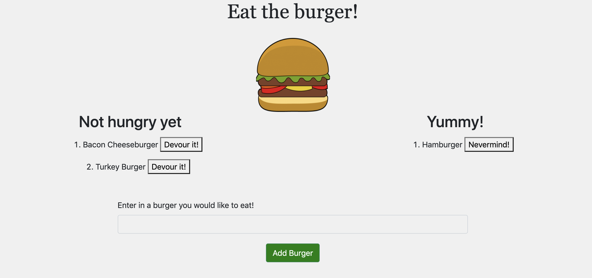

# burger

 

## Table of Contents
* [Title](#title)
* [Deployed Link](#deployed-link)
* [Site Picture](#site-picture)
* [Technologies Used](#technologies-used)
* [Description](#description)
* [Usage](#usage)
* [Work Involved](#work-involved)
* [Code Snippet](#code-snippet)
* [License](#license)
* [Authors](#authors)
* [Questions](#questions)
* [Acknowledgments](#acknowledgments)

## Deployed Link
* Click this link to view the site.
[Deployed Link](https://burger-eater70.herokuapp.com/)

## Site Picture


## Technologies Used
* javascript
* CSS
* MySQL
* Express
* NodeJs
* Handlebars
* ORM
* Heroku
* Github

## Description
This application is a fun burger logger! You can add your favorite burger, and decide whether you want to devour it or if you aren't hungry you can change your mind. 


## Work Involved
For this application, I developed the site using handlebars and CSS. I developed my database using MySQL. I used ORM in order to transfer my data from my database. I also deployed the site utilizing Heroku. 

## Code Snippet
* Allows you to update the SQL database by using ORM.
```
 update(table, objColVals, condition, cb) {
        let queryString = `UPDATE ${table}`;

        queryString += ' SET ';
        queryString += objToSql(objColVals);
        queryString += ' WHERE ';
        queryString += condition;

        console.log(queryString);
        connection.query(queryString, (err, result) => {
            if (err) {
                throw err;
            }

            cb(result);
        });
    },
```

## License
This project is covered under MIT.

## Authors
**UC Berkeley Coding Bootcamp**

**Jessny Joseph** 

## Questions 
* [Github](https://github.com/jessnyj)
* [LinkedIn](https://www.linkedin.com/in/jessny-joseph-361515201)

## Acknowledgments
Trilogy Education Services
